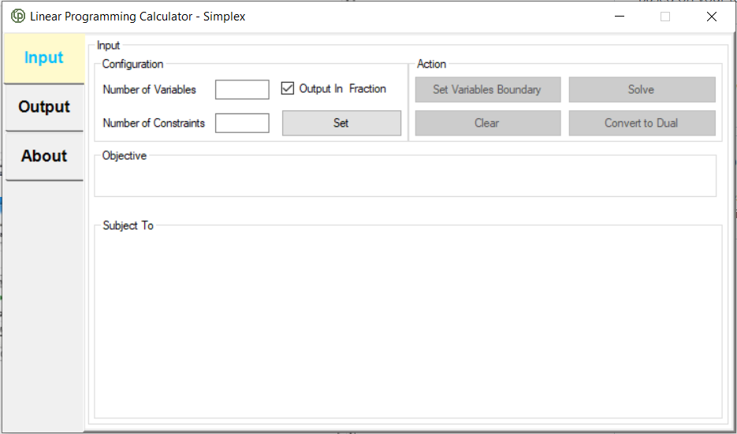

# Linear Programming Calculator - Simplex
* Main GUI

* Question input

* Step by step solution

* Convert to dual form

### Contribution
I contributed on the [simplex solver algorithm](https://github.com/soonchangAI/linear_optimization/blob/master/LinearOptimization/SimplexAlgo.cs) for Linear Programming

### Acknowledgement
This is a group assignment for Software Engineering taught by Dr Vishnu Monn Baskaran and guided by Mr. Gan Ming Tao.
